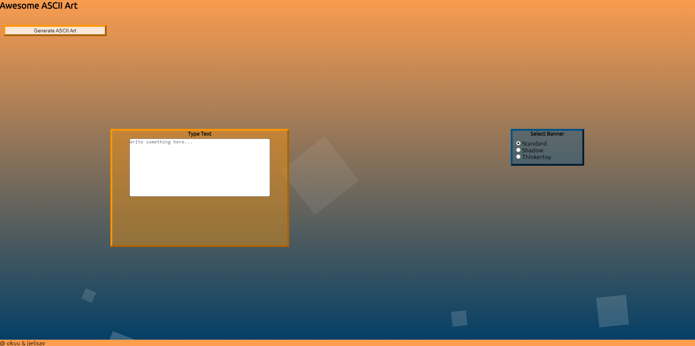
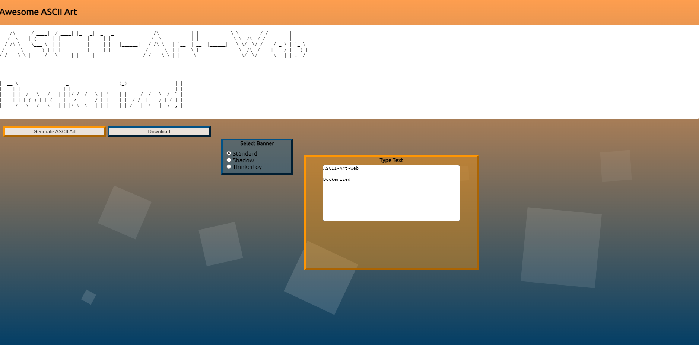

<p style='text-align: justify;'>

## ASCII Art Web

|  |  |
| --- | --- |


### Description

ASCII Art is a program which consists in receiving a string as an argument and outputting the string in a graphic representation using ASCII.

The current project includes following subprojects: 
-   [x] stylize
-   [x] dockerize
-   [x] exportfile

All required files for the application are located inside <code>app</code> folder.

Folder <code>res</code> contains functions responsible for displaying ASCII art. Folder <code>server</code> contains functions responsible for running a server.

Folders <code>templates</code> and <code>static</code> contain HTML, CSS and JavaScript files for the server and all available ASCII art banners are stored in <code>banners</code> folder.

### Allowed Packages

- Only the [standard go](https://golang.org/pkg/) packages are allowed.

### Audit Details

- Here you can see [audit details](https://github.com/01-edu/public/tree/master/subjects/ascii-art-web/audit).

### Usage without docker

- To run the code type in your terminal:
```
cd app
go run main.go
```
- Open your web browser and search http://localhost:8080
- Enjoy!
- To stop the server press in your terminal:
```
Ctrl + C
```

The ASCII art output field appears after the first art generation, the text area is used for user input. Desired banner style can be chosen by selecting a corresponding radio button.

To generate ASCII art press the <code>Generate ASCII Art</code> button with the text typed and the banner selected.

The program implements built into the home page form with POST method attribute which after giving the appropriate values to the text areas and radio buttons sends them to the server through the /ascii-art subpage, performs all the required calculations and redirects back to the home page where the results are taken from the global variable.

You can perform a hard refresh of the localhost web page in case some styles are not loading. For this, press the <code>Ctrl + F5</code>.

### Stylize

Now you can drag text-input and banner-selection blocks by holding your left mouse button over the block titles. CSS-flexbox approach has been used when writing initial css which means the design should be responsive.

### Export File

- Type in your text and select the banner.
- Press <code>Generate ASCII Art</code> to see the ASCII art resurt.
- Press <code>Download</code> button to download the file.txt with your last generated ASCII artwork.

### Dockerize

Check that you have Docker Desktop installed to your PC and WSL2 engine is enabled in the settings.
To build a docker image from the application run
```
bash d-start.sh
```
This will create a new docker image with settings provided inside the Dockerfile and start a new container based on that image. To stop and remove all the containers run
```
bash d-end.sh
```
You can also remove the image by running the following command
```
docker rmi ascii-art-web
```

### Group Members

- fpetuhov (okuu)
- jjelisav
</p>